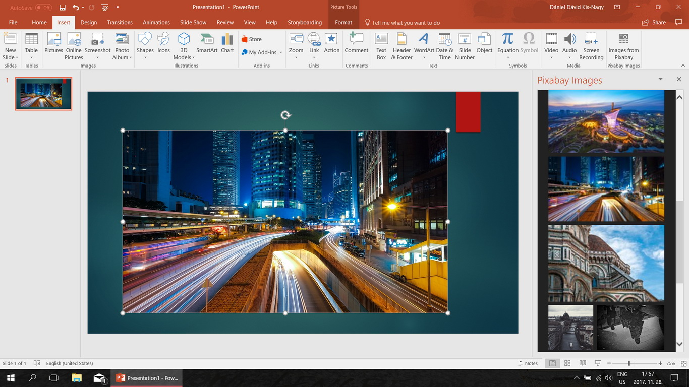
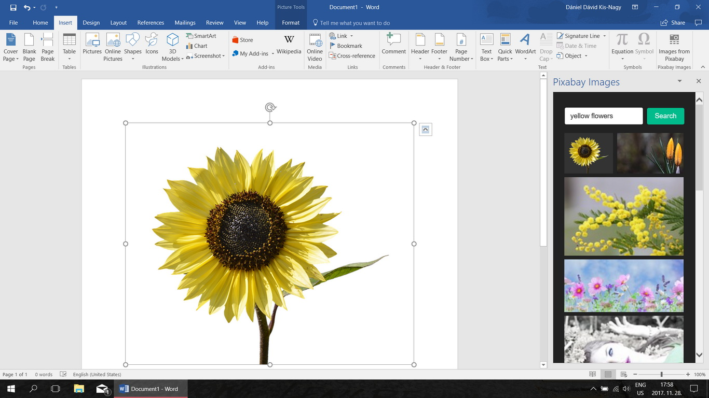
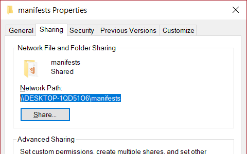

# Pixabay Images for Microsoft Word & PowerPoint

Using this add-in you can search free (Creative Commons CC0 licensed) images on [Pixabay](https://pixabay.com) right inside Word or PowerPoint – and insert them with one click.





## Installation

### Directly from the Office Store

1. Open a new document in Word or PowerPoint
2. On the _Insert_ tab, click _Office Add-ins_
3. Click _Store_, and just search for Pixabay
4. Click the _Add_ button next to _Pixabay images_

Alternatively, you can get it from [https://appsource.microsoft.com/en-us/product/office/WA104381335?tab=Overview](https://appsource.microsoft.com/en-us/product/office/WA104381335?tab=Overview)

### Sideloading

If you want to load a development version of the add-in, you will need to sideload it. It only takes a few minutes to complete these steps.

You can use the add-in with Office Online, or with the desktop apps on Windows or macOS, or even with iPad.

#### Office Online

1. Download the manifest file [uppp-vs.xml](https://raw.githubusercontent.com/madve2/uppp-pixabay-for-office/master/uppp-vs.xml)
2. Open Word Online or PowerPoint Online. (E.g. open a Word or PowerPoint document on OneDrive in the browser.)
3. On the Insert tab of the Ribbon, click *Office Add-ins*
4. Click *Upload My Add-in* in the upper-right corner
5. Select the manifest file you downloaded, click Upload

From now on, the Pixabay Images add-in will be available on the Insert tab, anytime you need it.


#### Windows

The add-in is actually available online, you just need to download the _manifest file_ (see below) and put it in a place where Word / PowerPoint expects to find it. This _has to be_ a network share, even if you install it just for yourself – but don't worry, it's very easy to create one.

1. Create a folder called `manifests` somewhere on your computer (e.g. `C:\Share\manifests`).
2. Download [uppp-vs.xml](https://raw.githubusercontent.com/madve2/uppp-pixabay-for-office/master/uppp-vs.xml), and save it to the new `manifests` folder.
3. Right-click the `manifests` folder, click *Properties*.
4. On the Sharing tab, click *Advanced Sharing*, then check the *Share this folder* box. Click OK.

Your network share is now available. Select and copy its path (e.g. `\\COMPUTERNAME\manifests`).



Now you need to tell Word / PowerPoint about this location.

1. Open Word or PowerPoint, and create a new document
2. Select *File > Options > Trust Center > Trust Center Settings > Trusted Add-in Catalogs*.
3. In the *Catalog Url* field, paste the path of the manifests folder (e.g. `\\COMPUTERNAME\manifests`). Click the Add catalog button. It will show up in the list below.
4. In the list, check the *Show in menu* box and then click OK.
5. On the Ribbon, select the Insert tab, and select My Add-ins. Select the *Shared Folder* tab.
6. Select the Pixabay Images add-in and click Insert. The add-in will load.


From now on, the Pixabay Images add-in will be available on the Insert tab, anytime you need it.


If you complete these steps for one application (e.g. Word), and you want to use the add-in in the other (e.g. PowerPoint), you should be able to start at Step 5., as the catalogs are shared between apps.

Tested in Word 2016 & PowerPoint 2016.

#### macOS and iPad

Download the manifest file [uppp-vs.xml](https://raw.githubusercontent.com/madve2/uppp-pixabay-for-office/master/uppp-vs.xml), and follow [these steps](https://github.com/OfficeDev/office-js-docs/blob/master/docs/testing/sideload-an-office-add-in-on-ipad-and-mac.md).

## Building the add-in yourself

You can run the add-in in a browser to try most functions, and you can use *Visual Studio 2017 Community* to enable debugging in Word / PowerPoint as well.

After cloning the repository, run `npm install` to download dependencies.

Make sure you have the [Angular CLI](https://github.com/angular/angular-cli) installed so you can run the commands described below.

### Running in browser

Run `ng serve` to start a dev server. Navigate to `http://localhost:4200/` to open the app. (Don't run the production build this way, as it waits for Office to initialize before starting the app, and that will never happen in the browser.)

Please note that you need to set your API key for Pixabay in `environments\environment.ts`, otherwise the API calls will fail.

```
export const environment = {
  //...
  apiKey: 'XXXXXXXXXXXXXXXXXXXXXXXXXXXXXXXX' //<-- add your key here
}
```

### Running inside Word / PowerPoint

First, create a production build by running `ng build --prod`. Then either host it online or on `localhost` (over HTTPS), and follow the steps above for sideloading, but change all the URLs in the manifest file to your server URLs.

To debug using Visual Studio, install *Visual Studio Community 2017* with the Office Tools selected, and clone this branch of the hosted application: [https://github.com/madve2/uppp-app/tree/vs](https://github.com/madve2/uppp-app/tree/vs). Replace the contents of the `uppp-vsWeb/app` folder with the production build you created during the previous step, and hit F5 to start debugging.
